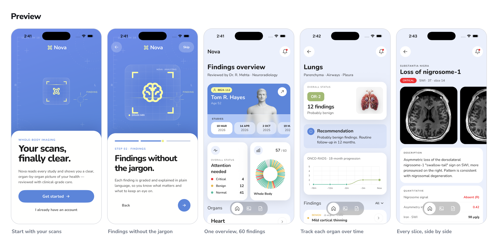

# Nova

Nova reads every study and shows you a clear, organ-by-organ picture of your health — reviewed with clinical-grade care.

> **Status: work in progress.** Beyond the product itself, this repo doubles as a sandbox for studying AI-agentic development — using AI agents to build features, review PRs, refactor code, and otherwise drive the day-to-day work on the app. The design and the initial codebase were built with [Claude Code](https://claude.com/claude-code) via vibe coding.

## About Nova

Nova is a whole-body imaging companion app. It turns dense scan reports into something a patient can actually read and act on:

- **Home** — a summary of your latest scan, organ/region breakdown by section, severity counts, and history across past studies.
- **Images** — browse a study's image series and view individual scans.
- **Documents** — the underlying reports and files behind each study.
- Built with [Expo](https://expo.dev) (Expo Router, React Native + Web), TypeScript, Tailwind (via `uniwind`), and `heroui-native`.

## Demo



- [Watch the iOS demo](assets/demo/demo-ios.mp4)
- [Watch the web demo](assets/demo/demo-web.mp4)

## Get started

1. Install dependencies

   ```bash
   yarn install
   ```

2. Start the app

   ```bash
   yarn start
   ```

   Or target a platform directly:

   ```bash
   yarn ios      # iOS simulator
   yarn android  # Android emulator
   yarn web      # Web
   ```

In the output, you'll find options to open the app in a [development build](https://docs.expo.dev/develop/development-builds/introduction/), Android emulator, iOS simulator, or [Expo Go](https://expo.dev/go).

Other useful scripts:

- `yarn lint` — lint and auto-fix
- `yarn check:types` — TypeScript type check
- `yarn check:circular` — check for circular imports
- `yarn check:code` — run all of the above
